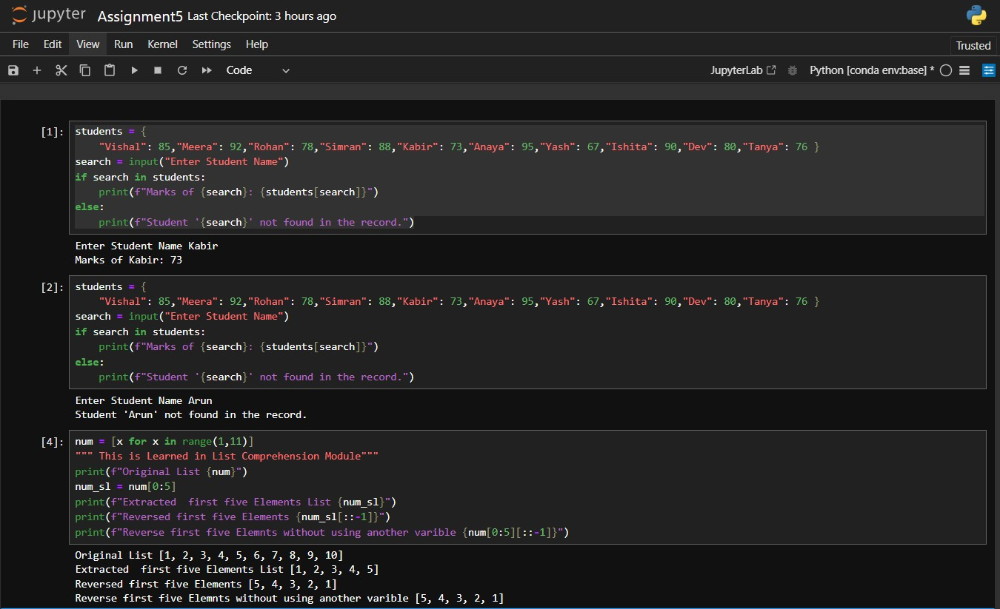

# 📘 Assignment 5 – Data Structures and Strings in Python

This repository contains solutions for **Module 6: Data Structures and Strings** in Python. The assignment includes two tasks: working with dictionaries and demonstrating list slicing.

---

## 📸 Screenshot

Please refer to the image below to see a sample run of both programs:

## 🔹 Task 1: Dictionary of Student Marks

### 🎯 Objective:
- Create a dictionary with student names as **keys** and their marks as **values**.
- Prompt the user to enter a student’s name.
- Display the student’s marks if found.
- Show an appropriate message if the student is not found.

---

## 🔹 Task 2: List Slicing Demonstration

### 🎯 Objective:
- Create a list of numbers from **1 to 10**.
- Slice and extract the **first 5 elements**.
- Reverse the sliced list.
- Display both the original slice and the reversed list.
